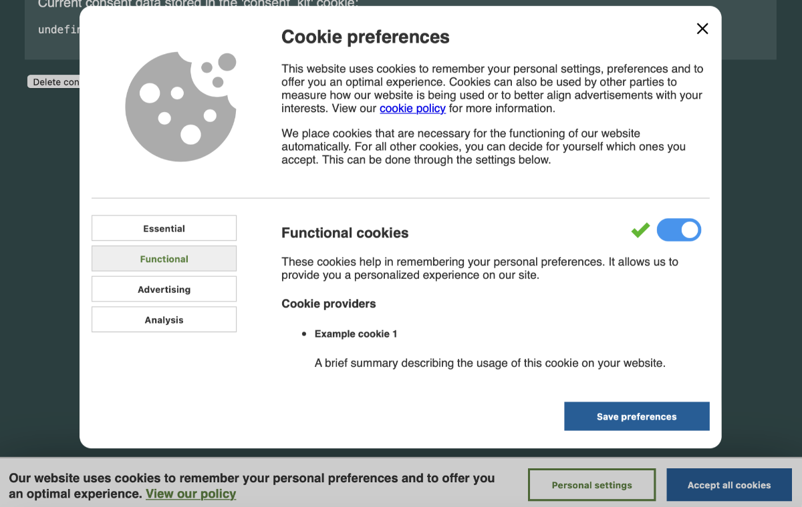
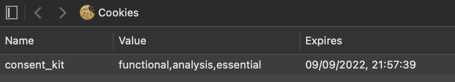

# consent-kit

**consent-kit** is a lightweight implementation of a GDPR-compliant banner and modal in vanilla JavaScript.

It allows the website visitor to easily **accept all** cookies or change his/her preferences through the **preference
screen**.

Behind the scenes, consent-kit places a cookie containing the stored preferences. The content of this cookie can then
easily be read with 3rd party tools. (Google Tag Manager is the most popular example)



## Demo site

You can view a full working example on [the consent-kit demo page](https://joeri-vlekken.github.io/consent-kit/).

## Use cases

- You want to implement a clean and lightweight cookie consent banner on your website that complies with the
  European [General Data Protection Regulation (GDPR)](https://ec.europa.eu/info/law/law-topic/data-protection_en).
- You want a responsive layout 'out of the box' but still be able to adapt the styling to your own preferences.
- You want to present your website users with the option to select categories of cookies.

## Installation

### Include the CSS and JS on your website

You can choose to embed the CSS and JS files through the
[jsDelivr](https://cdn.jsdelivr.net/npm/consent-kit@1.0.0/dist/) CDN network or install and host the packages yourself.

#### Embedding through CDN

Add the JS and CSS files in the `<head>` of your website:

```html
<link
  rel="stylesheet"
  href="https://cdn.jsdelivr.net/npm/consent-kit@1.0.0/dist/css/consent-kit.min.css"
/>
<script src="https://cdn.jsdelivr.net/npm/consent-kit@1.0.0/dist/js/consent-kit.min.js"></script>
```

#### Alternative: install the npm packages

You can host the files yourself by installing the package and referencing the files in your project:

```shell
npm install consent-kit --save
```

### Include the banner and modal

The banner and modal should be loaded inside the `<body>` of your website. See the example file in the `docs/`
folder.

### Enable consent-kit

To enable consent-kit (and show the cookie banner when the consent cookie is not present), fire the `consentKit()`
function in the '<body>' of your website:

```html
<script>
  consentKit({
    cookie_name: "consent_kit",
    expiry_days: 365,
  });
</script>
```

The `consentKit()` function requires 2 configuration parameters:

1. `cookie_name`: the consent cookie will be saved under this name when your website visitors gives a consent.
2. `expiry_days`: the expiration time (in days) for new consent cookies.

## How it works

Once consent-kit is loaded on your website, it will first check if a valid consent has been given, in that case the
consent banner and modal will remain hidden for your visitor.

In case consent has not yet been given, the consent banner will appear. The visitor will be presented with 2 choices:

### Accept all cookies

If the visitor clicks the 'Accept all cookies' button, the banner will immediately disappear and the consent cookie will be
installed with all cookie categories enabled.

### Personal settings

If the visitor clicks the 'Personal settings' button, a modal will popup and the user will be presented with the 4
cookie categories:

- Essential
- Functional
- Advertising
- Analysis

Except for the essential cookies (this categorie can not be turned off, the switch is greyed out by default in the
'active' state) the visitor can choose for each categorie to enable or disable the preferred cookie category.

### The cookie data

Once the cookie is updated: it will contain an array indicating the categories the visitors has consented to.
Note that `essential` will always be included in the list.



## Using a Tag Manager

Work in progress.
